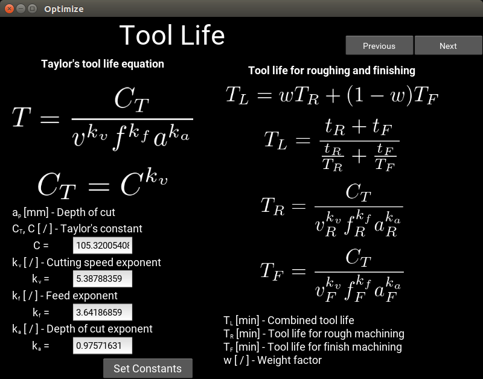

# Optimization of turning process

Scripts were made as part of bachelor's thesis:
[Optimization of turning process](thesis/Zavrsni_rad_Tomislav_Bazina_full.pdf)

## Summary

The first section of thesis describes the model for optimization of multi-pass turning process. Machining process defined in the model is divided into rough machining, carried out in one or multiple number of passes, and finish machining, carried out in one finishing pass. Straight turning process is also clarified in this section, and two objective functions, considering maximum productivity and minimum cutting cost criteria, are defined. Model bounds and constraints during roughing and finishing are elaborated.
The optimization software with graphical user interface is compiled, using Python programming language, in the second thesis section. Method applied for optimization is a combination of Basin- Hopping algorithm, used for finding the global minimum, and sequential quadratic programming, used for local optimization. Software is verified with data used in the reference and by practical experiment.

### Prerequisites

Scripts were made using:
* [Kivy](https://github.com/kivy/kivy) v1.9.1
* [Python](https://www.python.org/) v2.7.12
* [NumPy](https://github.com/numpy/numpy) v1.10.4
* [SciPy](https://github.com/scipy/scipy) v0.17.0
* [Matplotlib](https://github.com/matplotlib/matplotlib) v1.5.1

To start the application, run:
```
main.py
```

### Screenshots

Stock and contour Definition


Optimization type


Maximum productivity


Time input


Tool life


Bounds


Relations and surface


Force and power


Optimization parameters


Run Optimization


## License

This project is licensed under the MIT License - see the [LICENSE.md](LICENSE.md) file for details
